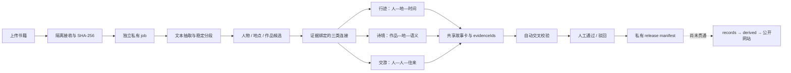

# 从书籍到三卷交互视据：证据优先的古诗词知识地图原型设计与验证

**原创比例：**［待填写］　　**参与比例：**［待填写］

> 初稿版本：v0.1（2026-08-25）  
> 说明：本文正文暂不写作者、班级和指导教师姓名，以便后续按匿名纸质稿要求排版。文中“压力测试稿”为专门编写的合成测试材料，其中人物、地点和事件组合不作为历史事实使用。

## 摘要

古诗词知识地图常把人物、地点、作品和关系集中展示，但“诗中写到某地”并不等于诗人到过该地，“两个人同时出现”也不等于二人存在交游。若系统只追求自动生成和视觉效果，候选信息很容易在地图或关系图中被误读为确定史实。为此，本文设计并实现了一个证据优先的古诗词书籍分析原型：用户上传书籍后，系统先在私有作业目录中完成文件校验、哈希记录和文本分段，再识别人物、地点与作品候选，分别生成行迹、诗境和交游三类连接；每条可见连接与故事卡均须绑定可回读的文本位置和证据摘要，候选经过自动校验和人工审核后，只生成私有发布清单，不直接进入公开网站。

本文以项目当前数据快照和合成压力样本进行初步验证。来源目录的 25 条记录以及公开五表均通过结构与来源校验；前端构建完成，61 项测试通过；在合成压力样本中，网页端本地规则提取出 11 条行迹、4 条诗境、2 条交游和 17 张故事卡，与预期结果一致，且结构校验无错误。对照实验同时发现，Python 入口在同一材料上存在过度提取，说明“结构合法”不能代替“语义正确”，两端规则仍需统一。研究表明，当前原型已能执行证据绑定、语义分层、候选审核和私有发布边界，但尚不能据此声称历史事实准确率、教学效果或完整自动公开发布能力。

**关键词：**古诗词；知识地图；数据溯源；数字人文；不确定性；人机协同审核

## 第一章　问题提出

### 一、研究背景

古诗词阅读同时涉及人物生平、地点变迁、作品内容和人物交往。传统文字材料信息丰富，却不容易让读者快速建立时间、空间和关系之间的联系；地图、时间线和关系图可以降低阅读门槛，但它们也会产生新的风险。例如，地图上的一个点看起来十分确定，实际上可能只是现代位置的近似展示；诗句中的地点属于文学空间，不能自动转化为作者行迹；关系图中的一条边也可能只是尚待回读的文本线索。

本项目早期已经形成行迹、诗境和交游三个阅读模块，但三类数据的来源定位、故事摘要和候选状态并不完全统一。随着“上传一本书，整理三卷候选”的功能推进，项目需要回答一个更基础的问题：系统怎样在自动处理的同时，保留“这条内容来自哪里、表达什么关系、目前是否经过审核”这些关键信息？

### 二、研究问题

本文围绕以下三个问题展开：

1. 如何使上传书籍在被切分、识别和可视化后，仍能回到原文件中的具体证据位置？
2. 如何区分人物行迹、作品空间和人物交游，避免由较弱线索推出更强的历史结论？
3. 如何通过候选状态、自动校验、人工审核与发布边界，使自动化能力不绕过证据审查？

### 三、研究目标与范围

本文的目标不是训练一个高准确率的历史信息抽取模型，而是建立并验证一条可运行、可回读、可阻断的原型流程。研究范围包括：

- 书籍接收、文本分段和私有作业管理；
- 人物、地点、作品及三类连接的候选生成；
- 证据、故事卡与交互视图的共享数据结构；
- 自动校验、人工审核和私有发布清单；
- 基于合成材料的规则压力测试与错误边界分析。

公开历史数据的全面学术审定、扫描件 OCR、完整公共发布器、算法准确率评价和教学效果研究不属于本文已经完成的结果。

## 第二章　相关研究与设计依据

### 一、数据溯源与可复现性

W3C 的 PROV-O 将实体、处理活动和责任主体作为溯源描述的基本组成，并支持记录对象如何被生成和派生[1]。FAIR 原则进一步强调，研究数据应具有明确标识、丰富元数据、合格引用和详细溯源；FAIR 也不等同于所有原始材料都必须公开，敏感数据可以通过访问控制管理[2]。这些思想启发本项目把原始文件、处理作业、候选连接和派生视图分层记录。不过，当前项目使用的是面向自身任务的 JSON 契约，并不声称已经完整实现 PROV-O 或 FAIR 认证。

### 二、文本定位与数字人文标注

W3C Web Annotation Data Model 使用“标注内容—目标资源—选择器”的方式描述对网页或文本片段的标注，并提供文本位置等选择方法[3]。Recogito 2 展示了数字人文场景中对文本地点进行标注、消歧和关联数据组织的实践[4]。本项目采用 `sourceFileId + text-span locator + excerptSha256` 记录证据，目的与上述工作相近：让审核者可以从候选返回原文，而不是只看到系统生成的摘要。

### 三、历史与文学空间的不确定性

历史地理信息的不确定性同时存在于空间、时间和属性描述之中[5]；文学地图还会受到语言歧义、叙事表达、读者解释和制图方式的影响[6]。因此，本项目不把所有地点统一处理为“人物到访点”，而是把三类关系分别建模：行迹回答“人—地—时间”，诗境回答“作品—地点—语义”，交游回答“人—人—往来”。

### 四、中国历史人物数据基础

中国历代人物传记资料库（CBDB）使用结构化关系数据组织中国历史人物的生平、任官、亲属和社会关系，并可服务于人物群体、空间和社会网络研究[7]。本项目把 CBDB 快照作为参考数据之一，同时保留项目自有来源清单与书籍证据定位；目录匹配只能帮助识别候选，不能代替对具体书籍内容的回读。

## 第三章　项目主线与总体设计

### 一、唯一主线

项目当前主线可以概括为：**上传一本书，在私有作业中生成带证据的三卷候选，经校验与人工审核后形成私有发布清单。**



图中的实线部分已经存在原型实现；最后一条虚线表示通用的公开发布适配器仍待完成。私有作业不会直接改写 `data/published/` 或 `web/public/data/`。

### 二、数据分层

项目把数据分为四层：

| 层次 | 主要内容 | 写入规则 | 作用 |
| --- | --- | --- | --- |
| 原始证据层 | 受治理史料、CBDB、诗词语料 | 登记后不可原地改写 | 回答“材料从哪里来” |
| 私有作业层 | 上传原文、分段、候选、模型响应、审核记录 | 一个上传拥有一个 job | 隔离隐私与中间结果 |
| 事实与派生层 | 审核后的事实包、版本化 release | 通过校验和明确审核后生成 | 回答“哪些内容被接受” |
| 交互展示层 | 行迹、诗境、交游页面 | 只消费批准的投影或明确的候选预览 | 回答“读者如何查看” |

这样的分层避免了两个常见问题：一是把上传原文或模型输出直接放进公共数据；二是为了修改网页显示而手工改写历史记录。

### 三、共享数据模型

三卷不各自保存一套人物、地点和故事，而是共享五类核心对象：

1. `entities.people / places / works`：人物、地点和作品实体；
2. `evidence[]`：可回读的证据对象；
3. `storyCards[]`：面向阅读的短摘要；
4. `volumes.journey.items[]`：行迹连接；
5. `volumes.poemWorld.items[]` 与 `volumes.social.edges[]`：诗境连接和交游边。

每条证据至少记录原文件标识、文本起止位置、支持类型、片段哈希和生产作业 ID。故事卡记录标题、摘要、事实/传统/解释类型、人物/地点/作品锚点和证据 ID，并带有“不是独立历史事实”的声明。三卷只引用实体、证据和故事卡 ID，避免同一内容在三个模块中被复制后逐渐出现矛盾版本。

### 四、三类语义边界

| 视图 | 最小关系 | 可以表达 | 不能自动推出 |
| --- | --- | --- | --- |
| 行迹 | `placeId + predicate + sequence/time + evidenceIds` | 出生、任职、寓居、贬谪、到达等生平动作 | 精确连续路线；没有证据的公历年份 |
| 诗境 | `workId + placeId + relationType + evidenceIds` | 作于、题写、描写或提及某地 | 诗人一定到访；所有地点都是创作地 |
| 交游 | `sourcePersonId + targetPersonId + relationTypes + evidenceIds` | 有文本线索支撑的往来候选 | 完整社会网络；自动确定友敌关系 |

其中最重要的防错规则是：作品题名或诗句中的地点不能反向生成行迹；故事卡不能凭自身摘要创造人物关系边；未消歧地点不能自动获得地图坐标；否定句不能进入候选队列。

## 第四章　原型实现方法

### 一、接收、隔离与分段

原型支持 `.txt`、`.text`、`.md` 和带文本层的 PDF。文件进入流程前需要明确的数据处理同意，并检查类型、大小、编码或 PDF 文本层，计算 SHA-256。原件和接收回执保存在隔离目录，随后创建独立 job。文本按句段切分，每个片段保留序号和字符偏移；扫描、加密、损坏或无有效文字的 PDF 被阻断，而不是交给模型猜测。

### 二、保守规则与可选模型增强

网页端默认使用本地规则：

- 用人物、地点和作品目录发现明确提及；
- 在同一分句中寻找地点与生平动作，形成行迹候选；
- 在作品上下文中区分 `composed-at`、`inscribed-at`、`describes-place` 和 `mentioned-place`；
- 只有同一上下文中出现中心人物、另一人物和明确往来触发词时，才形成交游候选；
- 检测“并非、未曾、并无”等否定表达，并限制候选必须属于用户选择的中心人物。

系统可以在用户单独同意后启用大模型增强，但模型只返回结构化候选和原文片段 ID。服务端会再次检查片段是否存在、候选是否属于中心人物、谓词是否与原文动作冲突，并重新生成证据引用。模型不能绕过校验和人工审核；调用失败时回退到本地规则。本文没有对模型增强的准确率作评价。

### 三、证据绑定与故事卡

候选连接生成后，系统不直接输出一段“完整故事”，而是先生成证据记录，再依据已有连接组织故事卡。每张故事卡至少有一条 `direct` 证据，并通过 `anchorRefs` 连接人物、地点和作品。这样，读者在交互界面看到摘要时，可以进一步回到“第几个文本片段”和具体字符范围。

### 四、校验、审核和发布边界

自动校验主要检查：

1. 每个可见连接和故事卡是否有直接证据；
2. 人物、地点、作品、故事和证据的 ID 引用是否闭合；
3. 行迹地点是否已经解析且具备可展示条件；
4. 诗境作品和交游关系是否属于中心人物范围；
5. 故事卡是否明确标注其非独立史实性质；
6. 草稿是否始终保持 `private / not-submitted`。

自动校验通过后，候选仍处于 `needs-review`。审核者可以逐条通过或驳回；只有通过的连接、故事和相关实体才会进入私有 release manifest。该 manifest 的状态是 `approved-for-curation`，表示“可进入下一步策展”，而不是“已经公开发布”。

## 第五章　验证方法与初步结果

### 一、验证快照

本次检查日期为 2026 年 8 月 25 日。由于当前工作区没有 Git 提交信息，本文使用检查日期、文件 SHA-256、数据清单和命令输出作为复现锚点。

| 对象 | 结果 | 结论边界 |
| --- | ---: | --- |
| 来源清单 | 25 条：22 approved、2 blocked、1 deprecated；0 error、0 warning | 准入状态和文件完整性通过规则校验，不等于每条史实均已考证 |
| 公开五表 | 26 人、89 地、152 事件、44 作品、16 来源；0 error、0 warning | 当前冻结数据满足字段、关系和来源定位契约 |
| 发布同步 dry-run | valid，5 个 canonical JSON 均列入 `wouldSync` | 证明可预演单向同步；本次未执行写入 |
| Python 自动测试 | 6 组共 42 项，2 项按设计跳过，无失败 | 证明输入、job、事实包、书籍包和原型契约的既定测试通过 |
| 前端构建与测试 | 构建完成，61 项测试通过 | 证明当前路由、数据载荷和关键防错规则可运行 |

这些结果主要回答“工程边界是否被执行”，不能直接回答“抽取出的历史判断是否都正确”。

### 二、合成压力测试设计

为测试容易误判的情况，项目编写了一份 12 个文本片段的合成材料，故意混入：

- 中心人物与旁支人物的行迹；
- 多个人物和多部作品在同一句中的切换；
- “并非作于”“未曾到达”“并无交游”等否定句；
- “至于杭州”一类话题标记；
- 作品标题含地点、人物只是并列出现等弱线索。

根据人工编写的预期清单，正确的审核队列应包含 11 条行迹、4 条诗境、2 条交游和 17 张故事卡，共 34 个待审核项目。该样本只用于检查规则边界，不是历史语料金标准，也不用于证明真实书籍上的准确率。

### 三、结果对照

| 实现 | 行迹 | 诗境 | 交游 | 故事卡 | 结构校验 |
| --- | ---: | ---: | ---: | ---: | --- |
| 人工预期 | 11 | 4 | 2 | 17 | — |
| 网页端本地规则 | 11 | 4 | 2 | 17 | 0 error、0 warning |
| Python 原型入口 | 17 | 11 | 5 | 33 | 0 error、0 warning |

网页端结果与预期清单一致，并生成 39 条证据记录。它正确排除了旁支人物行迹、否定句、题名地点反推行迹和无交游含义的人物并列。Python 入口生成了 55 条证据记录，但出现明显过度提取。

### 四、结果分析

这次对照产生了两个重要认识。

第一，中心人物作用域、分句绑定和否定识别是减少误判的关键。网页端的相关规则和测试已经覆盖这些情况，因此合成样本得到预期结果。

第二，**结构有效不等于语义正确**。Python 草稿虽然通过了引用、证据和状态校验，但候选数量仍然过多。这说明验证器能够发现“缺少证据”“引用不存在”“越过私有边界”等结构错误，却不能单独判断某段自然语言是否被正确理解。后续必须统一两端规则，并加入人工标注样本与误差分类。

## 第六章　可回读案例说明

以下案例均来自合成压力样本，用于展示处理逻辑，不作为史实结论。

### 一、同一句中的多种诗境关系

测试句把一部作品与“作于某地、描写某地、提到某地”三种表达放在一起。网页端将它们分别记为 `composed-at`、`describes-place` 和 `mentioned-place`，每条连接绑定同一原文片段中的不同语义位置。即使出现 `composed-at`，系统也不会由诗境连接自动创建人物行迹；行迹必须另有生平动作证据。

### 二、否定句阻断

“某人未曾到达某地”“某作品并非作于某地”“两人并无交游”均包含表面上可匹配的地点、作品和人物，但否定词改变了句义。网页端规则在动作或关系触发词前检查否定范围，因此三句话都不进入审核队列。这一设计体现了“宁可保留空结果，也不补写合理故事”的原则。

### 三、中心人物作用域

同一材料同时包含苏轼、李白和杜甫的句子，分析时中心人物选择为苏轼。系统可以识别其他人物为上下文实体，但不把他们的行迹、作品和交游连接加入苏轼的三卷。模型候选在合并阶段也必须再次通过中心人物检查。

## 第七章　讨论

### 一、当前原型的主要贡献

1. **把证据放在视图之前。** 地图点、关系边和故事卡都从证据对象派生，保留原文件、文本位置、片段哈希和作业 ID。
2. **把三种空间与关系语义分开。** 人物行迹、作品空间和人物交游各有受控关系词，避免把诗歌地点直接画成人生路线。
3. **把候选、审核和发布分开。** 自动生成只得到私有候选；人工审核后也只形成待策展的私有发布清单。
4. **把失败和空结果作为正常状态。** 无文本层 PDF、无可靠动作或无法消歧的地点可以被阻断或留空，而不是被猜测填满。

### 二、研究局限

1. 当前压力测试是合成材料，尚未建立来自真实史料的双人标注金标准，因此不能报告 precision、recall 或总体准确率。
2. 网页端与 Python 入口的语义规则尚未完全一致；同一压力样本的结果差异是目前最需要修复的工程问题。
3. 目录匹配覆盖有限。未收录作品、人物别名和复杂历史地名可能被漏掉或保留为未消歧候选。
4. 可选大模型增强只完成候选合并与边界测试，尚未在受控样本上进行独立评价。
5. 扫描 PDF 的 OCR 尚未纳入稳定流程；对不支持的文件只返回阻断状态。
6. 通用的 `review → records → derived → public` 发布适配器仍未实现，当前 release manifest 不会更新公共网站。
7. 本文没有进行用户实验，不能声称系统提高了学习兴趣、阅读理解或使用效率。

### 三、下一步工作

短期内应优先完成以下工作：

1. 以网页端规则为参照统一 Python 抽取逻辑，并把当前压力样本加入跨端一致性测试；
2. 从已发布事件中抽取 12—20 条，人工回读 `sourceRef` 和 locator，记录“支持、需修订、定位不足、待核对”；
3. 分别抽取少量诗境和交游候选，建立“支持、歧义、过度推断、数据问题、合理拒绝”的误差分类表；
4. 增加两个真实、可脱敏、可回读的案例卡，并为截图记录数据状态、筛选条件、版本和日期；
5. 在完成审核记录与发布适配器前，继续保持上传内容与公共数据的隔离。

## 第八章　结论

本文围绕“上传一本书后如何安全地生成三类古诗词知识视图”梳理并实现了一条证据优先主线。系统先保存来源、哈希和文本定位，再形成实体与连接候选；行迹、诗境和交游共享证据及故事卡，同时通过语义规则防止诗歌地点、人物并列和模型输出直接成为历史事实。当前来源与公开数据校验、原型构建和自动测试均已通过，网页端在合成压力样本上得到预期结果；跨端对照也暴露了 Python 入口过度提取的问题。

因此，现阶段最合适的结论是：项目已经建立了可运行的私有候选生成、证据绑定、结构校验和审核边界，为后续真实史料审计与交互展示提供了基础；它仍是一个需要人工回读和继续验证的原型，而不是能够自动发布历史事实的完成系统。

## 参考文献

[1] Lebo T, Sahoo S, McGuinness D, et al. [PROV-O: The PROV Ontology](https://www.w3.org/TR/prov-o/). W3C Recommendation, 2013.

[2] Wilkinson M D, Dumontier M, Aalbersberg I J, et al. [The FAIR Guiding Principles for scientific data management and stewardship](https://doi.org/10.1038/sdata.2016.18). *Scientific Data*, 2016, 3: 160018.

[3] Sanderson R, Ciccarese P, Young B. [Web Annotation Data Model](https://www.w3.org/TR/annotation-model/). W3C Recommendation, 2017.

[4] Simon R, Barker E, Isaksen L, de Soto Cañamares P. [Linked Data Annotation Without the Pointy Brackets: Introducing Recogito 2](https://doi.org/10.1080/15420353.2017.1307303). *Journal of Map & Geography Libraries*, 2017, 13(1): 111-132.

[5] Plewe B. [The Nature of Uncertainty in Historical Geographic Information](https://doi.org/10.1111/1467-9671.00121). *Transactions in GIS*, 2002, 6(4): 431-456.

[6] Reuschel A K, Piatti B, Hurni L. [Mapping Literature: Visualisation of Spatial Uncertainty in Fiction](https://doi.org/10.1179/1743277411Y.0000000023). *The Cartographic Journal*, 2011, 48(4): 293-308.

[7] Chen S, Wang H. [China Biographical Database (CBDB): A Relational Database for Prosopographical Research of Pre-Modern China](https://doi.org/10.5334/johd.68). *Journal of Open Humanities Data*, 2022, 8: 4.

## 项目内部材料

1. [《书籍 Agent 半成品》](BOOK_AGENT_PROTOTYPE.md)，2026-08-25。
2. [《上传书籍后的三张图数据结构设计》](THREE_MAP_DATA_MODEL.md)，2026-08-25。
3. [《书籍验证基线：私有三卷候选包》](BOOK_VALIDATION_BASELINE.md)，2026-08-25。
4. [《上传书籍工作流架构》](UPLOAD_WORKFLOW_ARCHITECTURE.md)，2026-08-24。
5. [《贡献主张—证据强度矩阵》](PAPER_HANDOFF/04_CLAIM_EVIDENCE_MATRIX.md)，2026-08-24。

## 附录 A　复现命令

```powershell
# 来源、公开数据和同步预演
python scripts/validate_source_materials.py --require-materialized-approved --json
python scripts/validate_published_data.py --json
python scripts/sync_published_data.py --dry-run --json

# 私有作业与书籍 Agent 测试
python scripts/test_upload_intake_and_extract.py
python scripts/test_poet_map_job.py
python scripts/test_validate_poet_fact_package.py
python scripts/test_book_package_manifest.py
python scripts/test_validate_private_volume_bundle.py
python scripts/test_book_analysis_agent.py

# 前端构建与测试
cd web
pnpm test
```

## 附录 B　关键文件 SHA-256

| 文件 | SHA-256 |
| --- | --- |
| `source-materials/source-manifest.json` | `5fde361a5a7f449d3a1980a6de924bc0fd32b3c0b980f4c15722e0dde3055043` |
| `data/contracts/book-analysis-draft.schema.json` | `07815c876721fd1c5f9439f440534cb394c51ea07c61cf13974d2a17e00c1cc5` |
| `web/lib/book-agent.ts` | `3a0515947c96517ebf74e493c41a1d12c41f29ade3d65644039f265692914a57` |
| `scripts/run_book_analysis_agent.py` | `e25dd59cb1a951929143e433480c594a5af62ac87df7cab1707be59fb6ae3da7` |
| `examples/book-agent-realistic-quality-test.txt` | `9d810e1e6aba389c56600afc237e1dbe7453ee4cc532fe80d29c518fd812ff07` |
| `examples/book-agent-realistic-quality-test-expected.md` | `3e1bf31471f2236e517738960d3d0e158c4acd277ad3d469fe813c01b89fe32e` |

## 附录 C　过程性记录模板

| 日期 | 工作内容 | 方法或工具 | 主要发现 | 问题与调整 | 证据文件 |
| --- | --- | --- | --- | --- | --- |
| 2026-08-25 | 梳理项目主线并冻结初稿数据 | 文档审计、只读校验、自动测试 | 主线收束为“私有 job → 三卷候选 → 审核 → 私有 release” | 区分旧公开五表与新上传流程 | 本文、相关验证输出 |
| 2026-08-25 | 运行合成压力测试 | 网页端本地规则、Python 原型对照 | 网页端符合预期；Python 端过度提取 | 将跨端一致性列为下一步 | 压力样本、预期清单、draft |
| ［待填写］ | 人工来源抽样审计 | ［待填写］ | ［待填写］ | ［待填写］ | `published-event-audit` |
| ［待填写］ | 真实案例与截图整理 | ［待填写］ | ［待填写］ | ［待填写］ | `case-cards`、`figures-manifest` |

## 附录 D　提交前待办

- [ ] 填写题目后的原创比例与参与比例。
- [ ] 完成至少 12 条已发布事件的人工来源抽样，更新第五章结果。
- [ ] 增加 2—3 张带版本、状态和来源锚点的交互截图。
- [ ] 根据学校要求转为 Word，并添加“当前页—总页数”格式页码。
- [ ] 纸质正文删除作者、班级、指导教师和致谢等身份信息。
- [ ] 电子稿末尾补充指导教师评语表和综评填报表；过程记录保留为附录。
- [ ] 完成查重与 AIGC 检测，并人工复核所有自动生成表述和参考文献。
