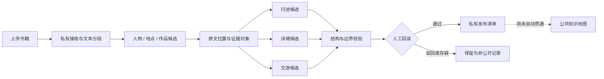

# 防止自动生成内容被误作史实：证据优先的古诗词知识地图生成流程

**原创比例：**［待填写］　　**参与比例：**［待填写］

> 修订初稿：v0.2（2026-08-25）  
> 匿名说明：正文暂不填写作者、班级和指导教师信息。本文报告的是原型与小规模验证结果，不把候选关系表述为已经考定的历史事实。

## 摘要

古诗词知识地图可以把人物、地点、作品和交往关系组织为地图、时间线与关系图，但自动分析产生的地点和人物连接，容易因视觉呈现而被读者误解为确定史实。例如，诗中提及某地不等于诗人到过该地，两个人在同一句中出现也不等于二人存在交游。针对这一问题，本文提出一种**证据优先的古诗词知识地图生成流程，重点解决自动生成内容被误当史实的问题**。流程在生成可视化之前，先保存来源文件、文本位置和证据片段；再把人物行迹、作品空间与人物交游分开建模；最后通过“私有候选—自动校验—人工审核—受控发布”的状态门，阻止未经核对的内容直接进入公开数据。

本文以网页端本地规则分析器为主实现，从《东坡全集》《李太白集分类补注》和《杜工部年谱》中选取 15 条可回读短句进行单轮人工核对，并以 12 段合成材料补充检查否定句、题名地点和中心人物切换等边界。在真实短句中，系统输出 4 条行迹连接，地点层面 Precision 为 100.0%、Recall 为 26.7%；若要求地点与动作谓词同时正确，Precision 为 50.0%、Recall 为 13.3%。15 次分析均通过结构校验，但只有 2 条关系在严格语义上正确。结果说明，现有规则较少生成错误地点，却对文言动词、人物简称和复杂分句存在明显漏检与误判；同时也说明“结构合法”不能代替“语义正确”。因此，本文的贡献不在于证明抽取算法已经准确，而在于给出一条能够保留证据、显式表达不确定性并在发布前阻断错误候选的可运行流程。

**关键词：**古诗词；知识地图；证据溯源；数字人文；信息抽取；人机协同审核

## 一、问题提出

### 1.1 研究背景

古诗词阅读往往同时涉及诗人生平、地理迁移、作品内容和人物交往。传统年谱、文集和注本保留了丰富细节，但这些信息分散在连续文本中，不便于读者快速建立时间、空间与关系之间的联系。知识地图能够把文字材料转化为地点、路线、作品空间和人物网络，却也会放大自动分析的确定感：一个地图点、一条连线或一张故事卡，看起来往往比它所依据的文本证据更“确定”。

这种风险至少包含三类语义越界。第一，作品题名或诗句提到某地，只能说明作品与该地存在文本关系，不能自动证明作者曾经到访。第二，两个人物共同出现，只能形成共现线索，不能自动证明交游。第三，规则或模型生成的流畅摘要可能混合原文事实、后人传说和系统解释，使读者难以判断内容来自何处。

因此，本研究没有把“多生成地图点”作为首要目标，而是关注一个更基础的问题：**当系统必然会漏检和误判时，怎样使自动生成的候选仍然可以回到原文、接受审核，并且不会直接变成公开史实？**

### 1.2 核心贡献与研究问题

本文的核心贡献可以收束为一句话：

> **提出一种证据优先的古诗词知识地图生成流程，重点解决自动生成内容被误当史实的问题。**

“误当史实”在本文中不是指系统能够消灭所有语义错误，而是指未经证据绑定和人工确认的自动结果，被直接写入已批准或公开的数据层。围绕这一可操作定义，本文回答三个问题：

1. 如何让地图点、关系边和故事卡都能够回到书籍中的具体文本位置？
2. 如何分开表达人物行迹、作品空间和人物交游，减少由弱线索推出强结论？
3. 在抽取准确率仍有限的情况下，候选状态与发布门能否阻止自动结果直接进入公开数据？

围绕核心贡献，本文只保留三个相互配合的设计：证据先于视图、三类语义分层、候选与发布分离。文件校验、哈希、目录组织和自动测试是流程落地所需的工程支撑，不作为独立研究创新点。

### 1.3 研究范围

本文实现并验证的是一个原型流程，而不是高准确率的古汉语信息抽取模型。研究包括书籍文本分段、实体与关系候选生成、证据定位、三类知识视图、结构校验、人工审核状态和私有发布清单。本文不声称已经完成全库史实审定、扫描件 OCR、全自动公共发布、总体准确率评价或教学效果验证。

## 二、相关研究与设计依据

### 2.1 数据溯源与文本标注

W3C PROV-O 从实体、活动和责任主体等方面描述数据如何生成与派生[1]；FAIR 原则强调研究数据的标识、元数据、引用与溯源[2]。这些研究提示数字人文系统不仅要保存结果，还应说明结果由什么材料、经过什么处理得到。W3C Web Annotation Data Model 进一步使用“标注内容—目标资源—选择器”描述文本标注，并支持通过文本位置返回原始资源[3]。Recogito 2 则展示了文本地点标注、消歧与关联数据组织在数字人文研究中的应用[4]。

本文借鉴上述思想，但不声称完整实现 PROV-O、FAIR 或 Web Annotation 标准。原型使用面向本项目的轻量数据契约，为每条连接记录来源文件、文本范围、证据摘要和处理作业，使审核者能够从可视化结果返回原文。

### 2.2 历史与文学空间的不确定性

历史地理信息的不确定性可能来自空间位置、时间范围和属性解释[5]；文学地图还会受到语言歧义、叙事表达和制图选择的影响[6]。因此，“人物在某地活动”和“作品写到某地”不宜合并成同一种地图关系。本文把行迹、诗境与交游分别建模，并为每类关系设置不同的最低证据条件。

中国历代人物传记资料库（CBDB）等结构化资源能够为人物生平、任官和社会关系研究提供重要基础[7]。本项目使用已有目录帮助识别人物与地点，但目录匹配只生成候选，不能替代对当前书籍语境的回读。

### 2.3 本文的切入点

已有研究为数据溯源、文本标注和不确定性表达提供了方法基础。本文进一步关注它们在一个具体生成流程中的组合：不是在可视化完成后补充来源说明，而是把证据定位和候选状态设置为生成地图关系的前置条件，并把公开发布设计为需要额外审核的独立步骤。

## 三、证据优先的生成流程

### 3.1 总体架构

项目主线为：**上传一本书，在隔离的私有作业中生成带证据的三类候选，经自动校验和人工审核后形成私有发布清单。**

图中最后一条虚线是有意保留的边界：当前原型生成的是“可进入后续策展”的私有清单，不会直接改写公共数据。这样，即使抽取规则得到错误候选，错误也不会仅因程序运行成功而自动获得“已发布事实”的状态。

### 3.2 证据先于视图

传统的结果优先流程通常先生成“人物—地点”或“人物—人物”关系，再在需要时补充来源。本文反转这一顺序：关系必须引用已经存在的证据对象，故事卡也只能依据已有连接组织。证据对象至少包含原文件标识、文本起止位置、原文摘录、摘录校验值和处理作业标识。

以《东坡全集》中的“乃以二月一日至黄州寓居定惠院”为例，系统处理过程如下：

该行迹条目不是因为“黄州”出现在文本中就成立，而是因为同一语境中同时存在中心人物范围、地点和“寓居”动作；展示端只引用候选及其证据，不自行扩写新的史实。

### 3.3 三类语义分层

三类视图共享人物、地点、作品、证据和故事卡，但不共享关系含义。

| 视图 | 最小关系 | 允许表达 | 不允许自动推出 |
| --- | --- | --- | --- |
| 行迹 | 人物—地点—动作/时间 | 任职、寓居、到达、贬谪、去世等生平动作 | 仅凭诗题或诗句推定到访 |
| 诗境 | 作品—地点—语义 | 作于、题写、描写或提及某地 | 把所有作品地点转成人物路线 |
| 交游 | 人物—人物—往来类型 | 有明确文本线索的会面、书信或唱和候选 | 由并列出现推定交游关系 |

这一分层的目的不是增加数据种类，而是降低推理强度。例如，“诗中提到赤壁”可以成为诗境候选；只有另有生平动作证据时，赤壁才可能成为行迹候选。

### 3.4 候选状态与发布门

自动分析输出统一标记为私有、待审核候选。结构校验检查证据引用是否存在、人物和地点 ID 是否闭合、候选是否属于所选中心人物、否定表达是否被阻断，以及故事卡是否声明其不是独立史实。结构校验通过后，审核者仍需阅读原文，并把候选标记为通过、驳回或待核对。

| 阶段 | 系统允许的表述 | 是否可进入公共数据 |
| --- | --- | --- |
| 自动生成 | “文本中可能存在该关系” | 否 |
| 结构校验通过 | “候选的字段和证据引用完整” | 否 |
| 人工回读通过 | “候选可进入后续策展” | 仍需发布适配步骤 |
| 公共发布 | “当前版本采用该关系” | 是，并保留来源与版本 |

这个状态门明确区分了“代码没有报错”“证据引用完整”和“语义已经确认”。

### 3.5 主实现与基线边界

本文的正式语义实现是网页端本地规则分析器。它基于人物、地点与作品目录，在分句范围内寻找动作线索，并处理否定表达、中心人物范围和题名地点等边界。Python 程序是项目早期用于验证作业流程、数据封装和命令行运行的基线，规则版本较早，不作为与网页端等价的正式算法，也不参与本文真实材料指标的计算。

## 四、验证设计

### 4.1 真实材料核对

为避免只在自编材料上验证，本文从项目已登记且状态为 `approved` 的三种真实书籍中选取短句：

| 书籍 | 中心人物 | 核对数量 | 选择目的 |
| --- | --- | ---: | --- |
| 《东坡全集》年谱 | 苏轼 | 5 | 包含任职、寓居、中止行程和去世等动作 |
| 《李太白集分类补注》后序 | 李白 | 5 | 包含“隐、留、憩”等文言表达及人物简称 |
| 《杜工部年谱》 | 杜甫 | 5 | 包含“赴、至、践、浮家”等迁移表达 |

每条短句均保留原文件与行号，人工标注一个人物—地点—动作金标准，再以相应人物为中心独立运行网页端规则。此次 15 条样本是为覆盖不同表达而进行的目的性小样本，不是随机抽样，也不是全书准确率。标注目前只完成单轮回读，提交前仍应由作者或第二位核对者复核。

### 4.2 评价口径

本文采用两个层次的指标：

- **地点连接口径**：人物与地点一致即记为正确，用于观察系统是否找到了正确的生平地点。
- **严格谓词口径**：人物、地点和动作类型全部一致才记为正确；地点正确但动作错误时，同时计入一个误报和一个漏报。

两种口径均计算 Precision = TP / (TP + FP) 和 Recall = TP / (TP + FN)。由于每条短句只标注一个目标关系，这些指标只描述本轮 15 条短句。

### 4.3 合成边界测试

项目另有一份 12 段合成压力材料，故意设置中心人物切换、否定句、作品标题含地点、人物并列和同句多种诗境关系。它用于回答“已知防错规则是否按预期执行”，不是历史语料金标准，因而只作为补充回归测试，不作为准确性主证据。

## 五、结果与分析

### 5.1 真实材料结果

系统在 15 条真实短句中共输出 4 条行迹连接，4 条的地点均与人工标注一致，其中 2 条的动作谓词也一致。

| 书籍 | 金标准关系数 | 输出数 | 地点正确数 | 严格正确数 |
| --- | ---: | ---: | ---: | ---: |
| 《东坡全集》 | 5 | 4 | 4 | 2 |
| 《李太白集分类补注》 | 5 | 0 | 0 | 0 |
| 《杜工部年谱》 | 5 | 0 | 0 | 0 |
| **合计** | **15** | **4** | **4** | **2** |

| 评价口径 | TP | FP | FN | Precision | Recall |
| --- | ---: | ---: | ---: | ---: | ---: |
| 人物—地点连接 | 4 | 0 | 11 | 100.0% | 26.7% |
| 人物—地点—动作严格一致 | 2 | 2 | 13 | 50.0% | 13.3% |

地点层 Precision 较高并不意味着系统已经可靠。一方面，系统只输出了 4 条关系，较少输出本身会提高 Precision；另一方面，Recall 只有 26.7%，说明大量真实关系根本没有进入审核队列。严格口径进一步表明，即使地点正确，动作也可能被过度简化。

### 5.2 正确案例与动作误判

| 原文 | 人工标注 | 系统输出 | 分析 |
| --- | --- | --- | --- |
| “至黄州寓居定惠院” | 黄州 / `resided-at` | 黄州 / `resided-at` | 地点与“寓居”在同一分句，识别正确 |
| “卒于常州” | 常州 / `died-at` | 常州 / `died-at` | 动作形式明确，识别正确 |
| “除通判杭州有赴任” | 杭州 / `held-office-at` | 杭州 / `traveled-to` | 找到地点，但把任职动作简化为移动 |
| “行至真州……中止于常州” | 常州 / `stayed-at` | 常州 / `traveled-to` | 邻近分句中的“行至”被错误绑定到常州 |

前两例说明规则能在表达直接时生成可回读候选；后两例则说明仅有证据摘录仍不能保证语义判断正确。审核界面必须同时展示原文和系统谓词，而不能只显示一个看似合理的地图点。

### 5.3 漏检与错误类型

李白和杜甫的 10 条短句均未形成行迹候选。主要原因不是书中没有地点，而是当前规则偏向现代、显式的动作表达，未覆盖文言叙述中的简称与省略。

| 错误类型 | 真实例子 | 对结果的影响 | 改进方向 |
| --- | --- | --- | --- |
| 文言动作词缺失 | “隐”“憩”“践”“浮家”“移知” | 有地点但不生成关系 | 建立带原句证据的受控动作词表 |
| 人物简称未解析 | “白”“甫”“先生” | 无法确认动作属于中心人物 | 在限定篇章内维护经审核的指代状态 |
| 动作粒度偏粗 | “赴任”被识别为到达 | 地点正确、谓词错误 | 区分移动事件与任职事件，制定优先级 |
| 分句绑定不足 | “行至真州……中止于常州” | 动作与错误地点配对 | 建立分句内动作—地点成对约束 |
| 人物称号与地名别名冲突 | “东坡先生” | 可能把称号识别成黄州地点别名 | 人物称号优先，并保留歧义状态 |

这些错误提供了比“测试全部通过”更有研究价值的信息：下一步不应简单扩大关键词正则，否则可能以提高 Recall 为代价引入更多误报；更合理的方向是让新增词表带有来源例句，并对人物指代和分句配对进行显式约束。

### 5.4 结构有效与语义正确的差别

15 条真实短句的输出均通过自动结构校验，即字段、引用、证据和状态满足数据契约；但严格语义正确的关系只有 2 条。由此可以得到一个直接结论：

> **结构校验能够证明候选“可追溯、可处理”，不能证明候选“语义正确”。**

这恰好说明人工回读不是原型尚未自动化完成的临时步骤，而是证据优先流程的必要组成。系统的目标不是把错误候选包装得更完整，而是使错误候选在公开前可被发现、解释和驳回。

### 5.5 合成边界测试与早期基线

在合成材料上，人工预期为 11 条行迹、4 条诗境、2 条交游和 17 张故事卡。网页端主实现得到 11/4/2/17，与预期一致；Python 早期基线得到 17/11/5/33，存在明显过度提取。两者均通过结构校验。

这一结果不被解释为网页端已具备真实语料高准确率。它只说明网页端实现了该合成样本预设的否定、中心人物和题名地点等边界，同时再次证明旧基线即使生成了完整证据结构，也可能在语义上过度抽取。后续维护中，Python 基线应只保留为工作流参考，或在统一规则后重新评价。

## 六、讨论

### 6.1 核心贡献如何得到支持

真实材料实验没有给出漂亮的准确率，却使本文的核心论点更清楚。现有规则对《东坡全集》的直接表达有一定识别能力，但对李白、杜甫材料中的文言表达大量漏检，并在“赴任”“中止”等动作上产生偏差。如果这些输出被自动写入公共地图，读者既可能看不到重要行迹，也可能把粗粒度或误绑定的动作当成已确认史实。

证据优先流程不能自动修复这些语义错误，但它改变了错误的去向：候选保留原文位置和处理状态，通过结构校验后仍停留在私有审核队列，只有人工回读通过的内容才有资格进入下一阶段。因此，本研究支持的是“自动结果可被阻断和审查”，而不是“自动结果已经正确”。

### 6.2 与普通结果优先流程的区别

| 对比维度 | 结果优先的自动生成 | 本文流程 |
| --- | --- | --- |
| 地图关系 | 生成后即可展示 | 先作为私有候选 |
| 来源 | 可能只保留书名或摘要 | 绑定文件、文本位置和原文摘录 |
| 语义 | 地点关系容易混合 | 行迹、诗境、交游分层 |
| 校验 | 关注字段是否可用 | 同时检查证据、范围和状态边界 |
| 发布 | 程序输出可能直接进入页面 | 人工回读与发布步骤分离 |
| 错误处理 | 难以解释生成依据 | 可定位、驳回或标记存疑 |

这种区别使系统即使在抽取性能有限时，仍具有可审计价值。其代价是需要人工审核，且保守规则会产生较多空结果；对于历史与文学材料，这一代价比无来源的流畅叙事更可接受。

### 6.3 局限

第一，本次真实材料只有 3 种书、15 条目的性选样，且目前由单人完成一轮标注，不能代表全书或其他文体。第二，实验只评价行迹连接，没有分别报告诗境和交游在真实材料上的 Precision 与 Recall。第三，当前规则对文言动词、人物简称、历史地名和复杂分句的处理能力有限。第四，人工审核界面与公共发布适配器尚未完全贯通，本文验证的是私有候选和发布边界原型。第五，尚未进行用户研究，不能声称该流程已经提升学习效果或审核效率。

### 6.4 后续研究

下一步应优先扩充经过双人复核的真实材料集，并分别评价行迹、诗境和交游；在此基础上建立文言动作词表、人物指代和动作—地点配对规则。随后可比较“只看系统摘要”和“同时回读证据”两种审核方式的正确率与耗时，以检验证据优先设计是否真正改善人工判断。只有当审核记录、版本追踪和发布适配器贯通后，才适合评价从私有候选到公共知识地图的完整流程。

## 七、结论

本文针对古诗词知识地图中“自动生成内容容易被误作史实”的问题，提出并实现了一条证据优先生成流程。它把来源定位设置为地图关系的前置条件，把人物行迹、作品空间和人物交游分开表达，并通过私有候选、结构校验、人工回读和受控发布建立状态边界。

三种真实书籍、15 条短句的初步核对表明：网页端规则在地点层面的 Precision 为 100.0%、Recall 为 26.7%，严格动作口径的 Precision 为 50.0%、Recall 为 13.3%。低召回和动作误判说明系统远未达到自动认定史实的程度；15 次结构校验全部通过而严格正确仅 2 条，则进一步说明结构合法不能替代语义审核。本文因此不把原型描述为“自动生成可信史实”的系统，而把它定位为一种**使自动候选有证可查、有状态可辨、有错误可拦截**的知识地图生成方法。

## 参考文献

[1] Lebo T, Sahoo S, McGuinness D, et al. [PROV-O: The PROV Ontology](https://www.w3.org/TR/prov-o/). W3C Recommendation, 2013.

[2] Wilkinson M D, Dumontier M, Aalbersberg I J, et al. [The FAIR Guiding Principles for scientific data management and stewardship](https://doi.org/10.1038/sdata.2016.18). *Scientific Data*, 2016, 3: 160018.

[3] Sanderson R, Ciccarese P, Young B. [Web Annotation Data Model](https://www.w3.org/TR/annotation-model/). W3C Recommendation, 2017.

[4] Simon R, Barker E, Isaksen L, de Soto Cañamares P. [Linked Data Annotation Without the Pointy Brackets: Introducing Recogito 2](https://doi.org/10.1080/15420353.2017.1307303). *Journal of Map & Geography Libraries*, 2017, 13(1): 111-132.

[5] Plewe B. [The Nature of Uncertainty in Historical Geographic Information](https://doi.org/10.1111/1467-9671.00121). *Transactions in GIS*, 2002, 6(4): 431-456.

[6] Reuschel A K, Piatti B, Hurni L. [Mapping Literature: Visualisation of Spatial Uncertainty in Fiction](https://doi.org/10.1179/1743277411Y.0000000023). *The Cartographic Journal*, 2011, 48(4): 293-308.

[7] Chen S, Wang H. [China Biographical Database (CBDB): A Relational Database for Prosopographical Research of Pre-Modern China](https://doi.org/10.5334/johd.68). *Journal of Open Humanities Data*, 2022, 8: 4.

## 附录 A　真实材料核对索引

15 条短句的原文、文件行号、人工标注、系统输出和逐条判断见[《论文证据核对记录 v1》](PAPER_EVIDENCE_AUDIT_V1.md)。该记录同时保留了指标计算口径和复现边界。

## 附录 B　工程可运行性验证

工程检查只用于说明原型能够运行，不作为抽取准确率证据。

| 检查对象 | 当前结果 | 能够说明 | 不能说明 |
| --- | ---: | --- | --- |
| 来源清单 | 25 条记录，0 error、0 warning | 来源准入与文件规则可执行 | 每条史实均已考定 |
| 公开数据快照 | 26 人、89 地、152 事件、44 作品、16 来源，0 error、0 warning | 数据引用满足现有契约 | 自动抽取语义正确 |
| Python 自动测试 | 6 组共 42 项，2 项按设计跳过，无失败 | 作业、数据包和校验流程可运行 | Python 基线与主实现语义一致 |
| 网页端构建与测试 | 构建完成，61 项测试通过 | 页面载荷与既定边界规则可运行 | 真实史料总体准确率 |
| 发布同步预演 | `valid` | 单向同步可以在写入前检查 | 公共发布流程已经自动贯通 |

复现入口和数据契约见项目内部文档：

1. [《书籍 Agent 半成品》](BOOK_AGENT_PROTOTYPE.md)；
2. [《上传书籍后的三张图数据结构设计》](THREE_MAP_DATA_MODEL.md)；
3. [《书籍验证基线：私有三卷候选包》](BOOK_VALIDATION_BASELINE.md)；
4. [《上传书籍工作流架构》](UPLOAD_WORKFLOW_ARCHITECTURE.md)。

## 附录 C　提交前最小补充项

- [ ] 由作者或第二位核对者复核 15 条金标准与判定，记录分歧。
- [ ] 增加 2—3 张带来源位置、候选状态和审核操作的真实案例截图。
- [ ] 按学校格式填写原创比例、参与比例、作者信息和页码。
- [ ] 人工核验参考文献格式、链接和全文术语一致性。
- [ ] 若篇幅受限，保留第五章真实结果，把工程验证继续放在附录。
