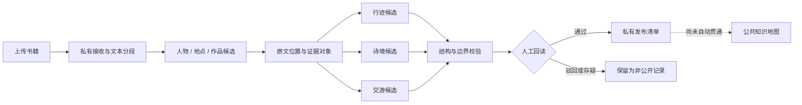

# 面向史实误判风险的证据优先古诗词知识地图生成流程

**原创比例：**［待填写］　　**参与比例：**［待填写］

> 修订初稿：v0.3（2026-08-25）  
> 匿名说明：正文暂不填写作者、班级和指导教师信息。本文评价的是原型流程和案例级审计，不把自动候选表述为已经考定的历史事实。

## 摘要

古诗词知识地图可以把人物、地点、作品和交往关系组织为地图、时间线与关系图，但自动分析产生的连接容易因可视化呈现而获得超过原文证据的确定感。例如，诗中提及某地不等于诗人到过该地，两个人物共同出现也不等于二人存在交游。本文提出一种**面向史实误判风险的证据优先生成流程**：系统在生成可视化之前保存来源文件、文本位置和证据片段，把人物行迹、作品空间与人物交游分开建模，并通过“私有候选—结构校验—人工回读—受控发布”的状态门，阻止未经审核的候选直接进入公共数据。

本文以网页端本地规则分析器为主实现，从《东坡全集》《李太白文集》《李太白集分类补注》《分门集注杜工部诗》《杜工部年谱》《宋史》和《新唐书》中选取 30 条可回读片段进行单轮案例审计，其中行迹 15 条、诗境 8 条、交游 7 条。行迹实验中，4 个输出地点均与人工目标一致，但系统只识别出 4/15 个目标关系，且仅 2 条的动作谓词也正确；诗境实验共生成 12 个作品—地点候选，其中 9 个得到文本支持、3 个属于过度连接；交游实验设置 5 个目标关系和 2 个应阻断案例，系统只找出 1 个目标人物边，同时产生 1 条由注释语境混合造成的错误边。30 次分析均通过结构校验。

结果表明，当前规则仍存在低召回、动作粒度偏差、短题名碰撞、人物简称漏检和注释误连等问题，尚不适合自动认定或公开历史关系；同时，所有结构校验通过而仍有语义错误，也说明字段合法不能代替人工判断。本文的研究对象因此不是高准确率抽取模型，而是**自动抽取出错时，候选能否保持可回读、可区分并在发布前被阻断**。初步结果支持该流程已建立这种安全边界，但其审核效果和读者认知影响仍需后续用户研究验证。

**关键词：**古诗词；知识地图；证据溯源；知识图谱；信息抽取；人在回路

## 一、问题提出

### 1.1 研究背景

古诗词阅读同时涉及诗人生平、地理迁移、作品内容和人物交往。年谱、文集和注本保存了丰富细节，但信息分散在连续文本中，不便于读者快速建立时间、空间和关系之间的联系。知识地图能够把文字材料转化为地点、路线、作品空间和人物网络，却也可能放大自动分析的确定感：一个地图点、一条连线或一张故事卡，看起来往往比其文本依据更像已经确认的事实。

风险主要来自三类语义越界。第一，作品题名或诗句提到某地，只能说明作品与该地存在文本关系，不能自动证明作者到访。第二，两个人物共同出现只能构成共现线索，不能自动证明交游。第三，流畅的自动摘要可能混合原文事实、后人注释和系统解释，使读者难以判断内容来自哪里。

本文不直接研究“读者是否已经把某条内容误认为史实”，因为这需要专门的用户实验。本文关注的是位于其上游、可以由系统行为验证的问题：**当自动分析必然会漏检和误判时，怎样使候选能够返回原文、接受审核，并且不会未经确认就进入公共数据？**

### 1.2 核心贡献与研究问题

本文的核心贡献为：

> **提出一种面向史实误判风险的证据优先古诗词知识地图生成流程，通过证据绑定、语义分层和审核发布门，阻止未经审核的自动候选直接进入公共数据。**

这里的“史实误判风险”指自动候选被赋予超过其证据和审核状态的确定性；本文实际验证的是其中的系统发布风险，而不是读者心理认知。围绕这一边界，本文回答三个问题：

1. 如何使地图点、关系边和故事卡返回书籍中的具体文本位置？
2. 如何分开表达人物行迹、作品空间和人物交游，减少由弱线索推出强结论？
3. 当三类抽取都存在错误时，候选状态与发布门能否避免错误直接成为公共数据？

本文只把证据先于视图、三类语义分层、候选与发布分离视为支持核心贡献的三个组成部分。哈希、目录、文件校验和自动测试属于实现支撑，不作为独立创新点。

### 1.3 研究范围

本文实现的是可运行的审核型原型流程，而不是高准确率古汉语信息抽取模型。研究范围包括文本分段、实体与关系候选、证据定位、三类知识视图、结构校验、人工审核状态和私有发布清单。本文不声称完成全库史实审定、扫描件 OCR、全自动公共发布、代表性准确率评价、审核效率验证或读者认知实验。

## 二、相关研究

### 2.1 数据溯源与文本标注

W3C PROV-O 从实体、活动和责任主体等方面描述数据如何生成和派生[1]；FAIR 原则强调研究数据的标识、元数据、引用与溯源[2]。W3C Web Annotation Data Model 使用“标注内容—目标资源—选择器”描述文本标注，并支持通过文本位置返回原始资源[3]。Recogito 2 展示了文本地点标注、消歧与关联数据组织在数字人文研究中的应用[4]。

本文借鉴这些思想，但不声称完整实现 PROV-O、FAIR 或 Web Annotation 标准。原型使用轻量数据契约，为连接保存来源文件、文本范围、证据摘要和处理作业，使审核者能够从地图关系返回原文。

### 2.2 历史与文学空间的不确定性

历史地理信息的不确定性可能来自空间位置、时间范围和属性解释[5]；文学地图还会受到语言歧义、叙事表达和制图选择影响[6]。因此，“人物在某地活动”和“作品写到某地”不宜合并为同一种关系。中国历代人物传记资料库（CBDB）等结构化资源可以支持人物生平、任官和社会关系研究[7]，但目录匹配只能帮助识别候选，不能代替对当前书籍语境的回读。

### 2.3 知识图谱构建与信息抽取

Hogan 等对知识图谱的数据模型、查询、验证、知识表示与知识获取进行了系统梳理，并指出知识可以通过演绎和归纳方法抽取[8]。这说明从文本生成图结构不仅是展示问题，还涉及实体识别、关系抽取、质量验证和后续发布等多个环节。

DeepDive 把从非结构化材料构建知识库概括为抽取、清洗和整合问题，并允许领域专家通过规则和监督知识参与系统构建[9]。与其统计推断方法不同，本文当前采用保守的本地规则；二者共同提示，输出结构化关系并不是流程终点，领域约束和错误分析仍然必要。

### 2.4 人在回路的关系抽取

Ristoski 等在大规模关系抽取中加入人在回路环节，用人工参与生成训练信息并缩小待处理范围，实验结果优于完全自动方法[10]。本文同样不把人工判断视为自动化失败后的补救，但人工角色不同：当前原型主要让审核者检查证据、决定候选状态并控制发布，而不是在线训练抽取模型。该差异也决定了本文首先评价“错误是否可见、是否被阻断”，后续才评价审核是否提升准确率和效率。

### 2.5 本文的切入点

已有研究分别提供了数据溯源、文本标注、不确定性、知识图谱构建和人在回路方法。本文的切入点是把它们组合成一个面向古诗词材料的生成顺序：不是先生成知识地图再补充来源，而是把证据定位和候选状态设为关系生成的前置条件，把公共发布设为需要额外确认的独立步骤。

## 三、证据优先的生成流程

### 3.1 总体架构

项目主线为：**上传一本书，在隔离的私有作业中生成带证据的三类候选，经结构校验和人工回读后形成私有发布清单。**

最后一条虚线是有意保留的发布边界：当前原型不会直接改写公共数据。因此，抽取错误不会仅因程序运行成功就获得“已发布事实”状态。

### 3.2 证据先于视图

结果优先的流程通常先生成“人物—地点”或“人物—人物”关系，需要时再补来源。本文反转这一顺序：关系必须引用已经存在的证据对象，故事卡也只能依据已有连接组织。证据对象至少包含原文件标识、文本起止位置、原文摘录、摘录校验值和处理作业标识。

以《东坡全集》中的“至黄州寓居定惠院”为例，系统先定位原文，再生成“苏轼—黄州—寓居”候选及直接证据；审核者确认后，它才有资格进入后续策展。展示端只引用候选和证据，不自行扩写新的生平事实。

### 3.3 三类语义分层

| 视图 | 最小关系 | 允许表达 | 不允许自动推出 |
| --- | --- | --- | --- |
| 行迹 | 人物—地点—动作/时间 | 任职、寓居、到达、贬谪、去世等生平动作 | 仅凭诗题或诗句推定到访 |
| 诗境 | 作品—地点—语义 | 作于、题写、描写或提及某地 | 把所有作品地点转成人物路线 |
| 交游 | 人物—人物—往来类型 | 有明确文本线索的会面、书信、唱和或师承候选 | 由并列出现推定交游 |

三类视图共享人物、地点、作品、证据和故事卡，但不共享关系含义。例如，《赤壁赋》与赤壁可以形成诗境候选；只有另有生平动作证据时，赤壁才可能进入苏轼行迹。

### 3.4 候选状态与发布门

自动分析结果统一标记为私有、待审核候选。结构校验检查证据引用、实体 ID、中心人物范围、否定表达和故事卡声明。结构校验通过后，审核者仍需回读原文，并把候选标记为通过、驳回或待核对。

| 阶段 | 系统能够证明 | 不能证明 | 是否可进入公共数据 |
| --- | --- | --- | --- |
| 自动生成 | 文本可能包含该关系 | 关系语义正确 | 否 |
| 结构校验通过 | 字段和证据引用完整 | 原文支持该谓词 | 否 |
| 人工回读通过 | 当前审核者接受该候选 | 结论永远无争议 | 仍需发布步骤 |
| 公共发布 | 当前版本采用该关系 | 全库已经完整 | 是，并保留来源和版本 |

### 3.5 主实现与基线边界

本文的正式语义实现是网页端本地规则分析器。它依据人物、地点和作品目录，在分句范围内寻找动作或关系线索，并处理否定表达、中心人物范围和题名地点等边界。Python 程序是早期用于验证作业流程和数据封装的基线，规则版本较早，不作为等价正式算法，也不参与真实材料结果计算。

## 四、验证设计

### 4.1 评价对象

本文首先评价的是流程在错误条件下的可审计性和发布边界，而不是把当前规则与先进抽取模型比较。语义核对仍然必要，因为只有先暴露真实错误，才能检查这些错误是否保留证据、停留在候选层并等待审核。

评价包含两个互不替代的层面：

1. **语义层**：人工判断候选是否得到原文支持，以及系统是否漏掉目标关系；
2. **流程层**：候选是否绑定证据、保持待审核状态，且不直接写入公共数据。

### 4.2 真实材料案例审计

本次从 7 种已批准材料中选取 30 条片段：

| 类别 | 片段数 | 材料 | 判断重点 |
| --- | ---: | --- | --- |
| 行迹 | 15 | 《东坡全集》《李太白集分类补注》《杜工部年谱》 | 人物—地点和动作谓词 |
| 诗境 | 8 | 《东坡全集》《李太白文集》《分门集注杜工部诗》 | 作品—地点支持、短题名碰撞和相邻误配 |
| 交游 | 7 | 《宋史》《新唐书》《李太白文集》《分门集注杜工部诗》 | 会面、门人、送别、多人句和注释误连 |

每条片段保留原文件与行号，删除页面和换行标记后独立运行。样本是为覆盖不同风险而进行的目的性选样，不是随机抽样；人工判断目前也只有一轮。因此，本文把结果称为“案例级审计”，不外推为全书或全库准确率。

行迹仍保留 Precision 和 Recall 的基本口径，但正文优先报告分子与分母。诗境和交游包含特意设置的正例、阻断例和歧义注释，只报告逐项计数，不计算总体百分比。

### 4.3 合成边界测试

另有一份 12 段合成材料，用于回归检查中心人物切换、否定句、题名地点和人物并列等已知规则。合成材料只回答既定防错规则是否执行，不作为真实准确性证据。

## 五、结果与分析

### 5.1 阅读结果前的解释边界

本章中的低召回和错误连接说明当前抽取规则效果有限，但这不直接否定本文的研究对象。本文要检验的是：**这些错误是否仍然带有原文位置、是否保持为待审核候选、是否会被自动发布。** 如果规则已经完全正确，证据回读和发布门反而难以在实验中显示其必要性。

与此同时，安全流程也不能把低质量抽取变成实用系统。当前原型可以用于生成少量可审核候选和发现错误类型，尚不能替代人工通读或作为自动公共知识库生产工具。

### 5.2 三类真实材料结果总览

| 类别 | 人工设置 | 系统结果 | 主要发现 |
| --- | --- | --- | --- |
| 行迹 | 15 个目标关系 | 4 个输出地点均正确；其中 2 个动作谓词正确 | 只覆盖 4/15 个目标，文言动作漏检严重 |
| 诗境 | 8 个案例片段 | 生成 12 个候选：9 个有文本支持，3 个过连 | 长题名较稳定，短题名和相邻作品容易误配 |
| 交游 | 5 个目标关系、2 个应阻断案例 | 找出 1 个目标人物边；正确阻断 1 例；另产生 1 条错误边 | 指代、作品作者、多人句和注释层级是主要问题 |

行迹的常见指标写成计数形式为：地点口径 Precision = 4/4、Recall = 4/15；要求地点和动作同时正确时，Precision = 2/4、Recall = 2/15。百分比和计算细节放在审计附件中，避免把 15 条目的性样本表现为大规模评测。

### 5.3 行迹：地点正确不等于动作正确

| 原文 | 人工标注 | 系统输出 | 分析 |
| --- | --- | --- | --- |
| “至黄州寓居定惠院” | 黄州 / `resided-at` | 黄州 / `resided-at` | 表达直接，地点与动作均正确 |
| “卒于常州” | 常州 / `died-at` | 常州 / `died-at` | 明确动作能够识别 |
| “除通判杭州有赴任” | 杭州 / `held-office-at` | 杭州 / `traveled-to` | 找到地点，但把任职简化为移动 |
| “行至真州……中止于常州” | 常州 / `stayed-at` | 常州 / `traveled-to` | 邻近分句中的动作与地点误绑定 |

李白和杜甫的 10 条行迹短句均未形成候选，主要原因包括“隐、憩、践、浮家、移知”等文言动词缺失，以及“白”“甫”等简称没有解析。

### 5.4 诗境：题名匹配与语境碰撞

在《初到黄州》《峨眉山月歌》《早发白帝城》和《陪裴使君登岳阳楼》等明确题名中，系统能够生成有原文支持的作品—地点候选。《黄鹤楼送孟浩然之广陵》的题名和异题注则生成黄鹤楼、扬州、岳阳三个待核对文本联系，说明异题也需要在展示时保留版本说明。

3 个错误候选来自两个案例：

- “遂入蜀**卜居**成都”中的“卜居”是居住动作，却与杜甫作品《卜居》同形，系统错误生成《卜居》—成都；
- “回自东都有新安吏石壕吏潼关吏”同时出现行程和多部作品，系统错误生成《新安吏》—洛阳与《石壕吏》—潼关。

这说明作品目录的字符串命中只能形成候选，不能直接形成作品空间事实；系统还需要区分作品题名、普通词、异题、正文和注释层级。

### 5.5 交游：关系词之外还需要语篇判断

在“欧阳修……荐之秘阁”案例中，系统生成苏轼—欧阳修人物边，人物关系得到原文支持，但同时标记 `literary-exchange` 和 `official`，其中前者范围偏宽。其余真实案例暴露出不同层次的问题：

- “道过金陵见王安石”因“见”和对话结构不在触发规则内而漏检；
- “秦观俱游苏轼门”未被识别为门人关系；
- 《黄鹤楼送孟浩然之广陵》虽有作者目录和“送孟浩然”，但作品作者没有传递到交游识别；
- “甫……从白及高适过汴州”同时包含简称和三个人物，未生成杜甫—李白关系；
- 杜诗注释先说崔宗之与李白唱和，随后用阮籍解释“白眼”，系统却把李白与阮籍误连为文学交往。

最后一例尤其说明，词语“唱和”本身不是充分条件；注释边界和实际主语必须共同确定关系对象。

### 5.6 结构有效与语义正确

30 次真实材料分析全部通过结构校验，但三类关系都出现语义错误或漏检。因此：

> **结构校验能够证明候选可追溯、可处理，不能证明候选语义正确。**

所有候选仍带有原文位置和 `needs-review` 状态，没有写入事实记录或公共数据。由此得到的流程层结果是：当前发布边界能够阻止这些已观察到的错误自动成为公共数据；尚未得到验证的是审核者是否一定能发现全部错误，以及这种展示能否降低读者的史实误判。

### 5.7 合成测试与早期基线

合成材料的人工预期为 11 条行迹、4 条诗境、2 条交游和 17 张故事卡。网页端主实现得到 11/4/2/17；Python 早期基线得到 17/11/5/33，存在过度提取。该结果只说明网页端满足这份合成材料预设的边界，不代表真实语料高准确率。Python 结果只作为“结构通过仍可能语义过抽”的早期对照。

## 六、讨论

### 6.1 当前系统是否实用

若“实用”指自动从古籍中抽取并发布可靠关系，答案是否定的：行迹只找到 4/15 个目标，交游只找到 1/5 个目标人物边，且诗境与交游都出现错误连接。它目前不能替代人工阅读，也不能用空结果证明书中没有相关关系。

若“实用”指辅助研究者发现少量候选、返回原文并在发布前逐条处理，原型已经具备初步价值。即使候选错误，审核者仍能看到原句、关系类型和状态，并选择驳回或存疑。换言之，当前实用性来自可审计工作流，而不是抽取覆盖率。下一阶段必须同时提升抽取质量和验证审核效果，不能用安全边界掩盖算法不足。

### 6.2 核心论点得到的支持

真实案例表明三类关系具有不同错误机制：行迹主要漏掉文言动作，诗境容易发生短题名碰撞，交游依赖指代和注释层级。把三类关系分开，使审核者能够针对不同风险读取证据；把自动结果留在私有候选层，则使错误不会直接进入公共地图。

因此，本研究支持的是一个有限命题：**在当前原型中，未经审核的三类候选被保持在私有层，并可由原文证据回读和阻断。** 本文没有证明读者不会误认史实，也没有证明人工审核必然正确。

### 6.3 局限

第一，30 条仍是目的性案例样本，不是随机或分层抽样，不能代表全书分布。第二，人工判断只有一轮，尚无标注者一致性结果。第三，只有行迹保留了简单 Precision/Recall；诗境和交游使用混合正例、负例和歧义注释，只报告计数。第四，规则对文言动词、简称、历史地名、作品异题、多人句和注释结构处理有限。第五，人工审核界面和公共发布适配器尚未完全贯通。第六，本文没有用户实验，不能声称证据展示降低了读者误判或提升了审核效率。

### 6.4 后续研究

下一步应把案例集扩展为经过双人独立标注的分层样本，并记录“支持、过度推断、歧义、合理拒绝、数据问题”等类别。算法上应建立带来源例句的文言动作词表、章节内人物指代、作品题名边界和注释层级解析。流程上可比较“只看系统摘要”与“同时回读证据”两种审核方式的判断正确率、耗时和分歧，以验证证据优先设计是否真正改善人工决策。最后，在审核记录、版本追踪和发布适配器贯通后，再评价完整的私有候选到公共知识地图流程。

## 七、结论

本文面向古诗词知识地图中的史实误判风险，提出了一条证据优先生成流程。它把来源定位设置为地图关系的前置条件，把人物行迹、作品空间和人物交游分开表达，并通过私有候选、结构校验、人工回读和受控发布建立状态边界。

30 条真实材料案例显示：行迹只识别出 4/15 个目标地点，且仅 2 条动作谓词正确；诗境的 12 个候选中有 9 个得到文本支持、3 个过连；交游的 5 个目标关系只找出 1 个，并产生 1 条注释误连。所有分析均通过结构校验，却仍存在语义错误。这一结果不支持“系统已经能够自动生成可靠史实”，但支持一个更有限的结论：当前原型能够使自动候选有证可查、有状态可辨，并阻止未经审核的候选直接进入公共数据。读者认知、审核效果和抽取实用性仍需更大样本与用户实验验证。

## 参考文献

[1] Lebo T, Sahoo S, McGuinness D, et al. [PROV-O: The PROV Ontology](https://www.w3.org/TR/prov-o/). W3C Recommendation, 2013.

[2] Wilkinson M D, Dumontier M, Aalbersberg I J, et al. [The FAIR Guiding Principles for scientific data management and stewardship](https://doi.org/10.1038/sdata.2016.18). *Scientific Data*, 2016, 3: 160018.

[3] Sanderson R, Ciccarese P, Young B. [Web Annotation Data Model](https://www.w3.org/TR/annotation-model/). W3C Recommendation, 2017.

[4] Simon R, Barker E, Isaksen L, de Soto Cañamares P. [Linked Data Annotation Without the Pointy Brackets: Introducing Recogito 2](https://doi.org/10.1080/15420353.2017.1307303). *Journal of Map & Geography Libraries*, 2017, 13(1): 111-132.

[5] Plewe B. [The Nature of Uncertainty in Historical Geographic Information](https://doi.org/10.1111/1467-9671.00121). *Transactions in GIS*, 2002, 6(4): 431-456.

[6] Reuschel A K, Piatti B, Hurni L. [Mapping Literature: Visualisation of Spatial Uncertainty in Fiction](https://doi.org/10.1179/1743277411Y.0000000023). *The Cartographic Journal*, 2011, 48(4): 293-308.

[7] Chen S, Wang H. [China Biographical Database (CBDB): A Relational Database for Prosopographical Research of Pre-Modern China](https://doi.org/10.5334/johd.68). *Journal of Open Humanities Data*, 2022, 8: 4.

[8] Hogan A, Blomqvist E, Cochez M, et al. [Knowledge Graphs](https://doi.org/10.1145/3447772). *ACM Computing Surveys*, 2021, 54(4): Article 71.

[9] Zhang C, Ré C, Cafarella M J, et al. [DeepDive: Declarative Knowledge Base Construction](https://doi.org/10.1145/3060586). *Communications of the ACM*, 2017, 60(5): 93-102.

[10] Ristoski P, Gentile A L, Alba A, Gruhl D, Welch S. [Large-scale relation extraction from web documents and knowledge graphs with human-in-the-loop](https://doi.org/10.1016/j.websem.2019.100546). *Journal of Web Semantics*, 2020, 60: 100546.

## 附录 A　真实材料核对索引

30 条案例的文件、行号、人工判断和系统输出见[《论文证据核对记录 v2》](PAPER_EVIDENCE_AUDIT_V2.md)。原 15 条行迹的完整逐项记录保留在[《论文证据核对记录 v1》](PAPER_EVIDENCE_AUDIT_V1.md)。

## 附录 B　工程可运行性验证

工程检查只说明原型能够运行，不作为语义准确性证据。

| 检查对象 | 当前结果 | 能够说明 | 不能说明 |
| --- | ---: | --- | --- |
| 来源清单 | 25 条记录，0 error、0 warning | 来源准入和文件规则可执行 | 每条史实均已考定 |
| 公开数据快照 | 26 人、89 地、152 事件、44 作品、16 来源，0 error、0 warning | 数据引用满足现有契约 | 自动抽取语义正确 |
| Python 自动测试 | 6 组共 42 项，2 项按设计跳过，无失败 | 作业、数据包和校验流程可运行 | Python 基线与主实现语义一致 |
| 网页端构建与测试 | 构建完成，61 项测试通过 | 页面载荷和既定边界规则可运行 | 真实史料总体准确率 |
| 发布同步预演 | `valid` | 写入前可以执行单向同步检查 | 公共发布已经自动贯通 |

## 附录 C　提交前最小补充项

- [ ] 由第二位核对者独立复核 30 条案例，并记录分歧及最终处理。
- [ ] 增加 2—3 张显示原文位置、候选状态和审核操作的真实案例截图。
- [ ] 按学校格式填写原创比例、参与比例、作者信息和页码。
- [ ] 人工核验全部参考文献格式和文内编号。
- [ ] 若篇幅受限，优先保留第五章真实结果，把工程验证继续放在附录。
